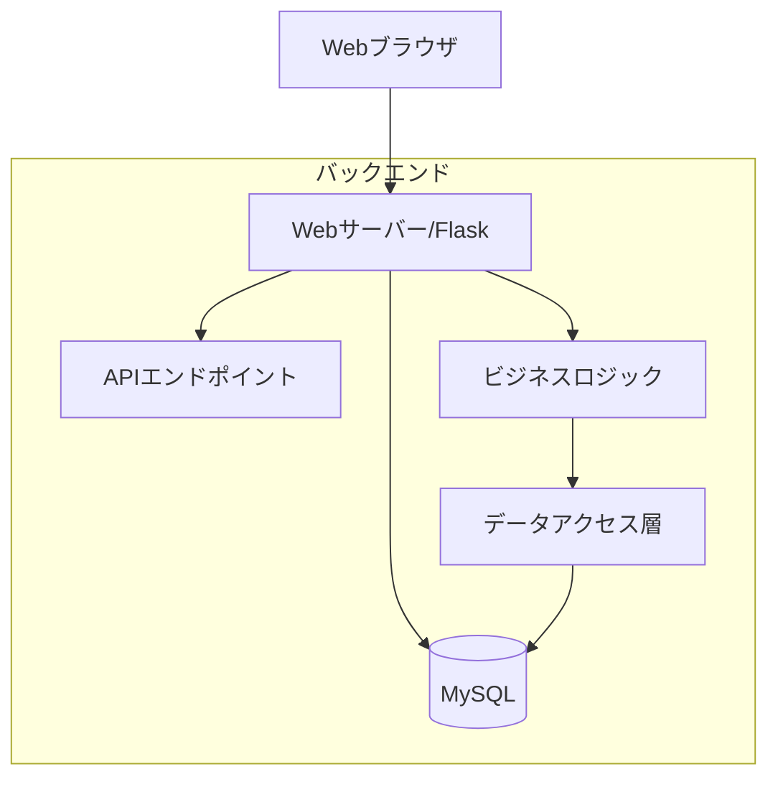
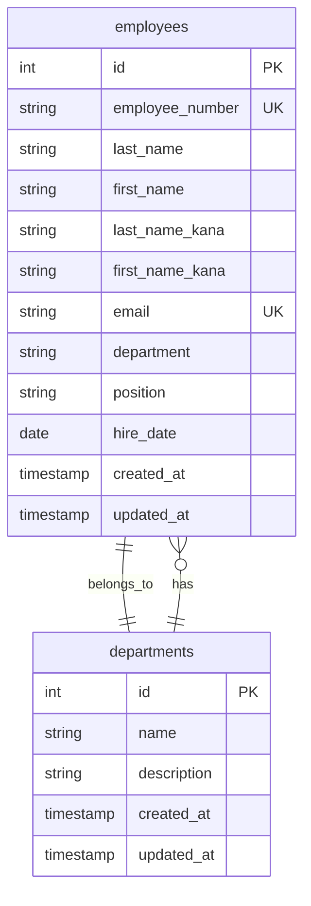

# System Patterns

## システムアーキテクチャ



## データベース設計



## コンポーネント構成

### バックエンド構成

```
backend/
├── app.py          # アプリケーションのエントリーポイント
├── config.py       # 設定ファイル
├── extensions.py   # Flask拡張の初期化
├── models/         # データモデル
│   └── employee.py # 従業員モデル
└── routes/         # APIルート
    └── employee_routes.py # 従業員関連API
```

### フロントエンド構成

```
frontend/
├── static/
│   ├── css/
│   │   └── style.css    # カスタムスタイル
│   └── js/
│       └── main.js      # メインスクリプト
└── templates/
    └── index.html       # メインページ
```

## 設計パターン

### バックエンド

1. レイヤードアーキテクチャ

   - プレゼンテーション層（API）
   - ビジネスロジック層
   - データアクセス層

2. リポジトリパターン

   - データベースアクセスの抽象化
   - SQLAlchemy による ORM の活用

3. Blueprint パターン
   - ルーティングの分割
   - コードの整理と再利用性の向上

### データベース設計パターン

1. 正規化

   - 第 3 正規形までの正規化
   - 参照整合性の確保
   - インデックス最適化

2. タイムスタンプ管理
   - created_at, updated_at の自動更新
   - 監査証跡の確保

### API パターン

1. エンドポイント設計

   - RESTful API の原則に従う
   - リソース名は複数形を使用
   - HTTP メソッドを適切に使用

2. レスポンス形式

   - 一貫した JSON レスポンス形式
   - エラーレスポンスの標準化

3. バリデーション

   - 入力値の検証
   - ビジネスルールの適用
   - エラーメッセージの明確化

4. エラーハンドリング
   - HTTP ステータスコードの適切な使用
   - 詳細なエラーメッセージの提供
   - グローバルエラーハンドラーの実装
